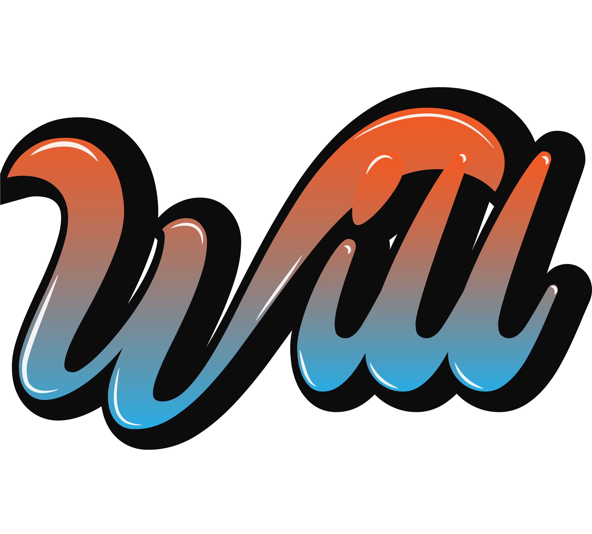

# Welcome to will python project - willpy or wpy

## This project provides

- Python Aerodynamics
- Python Data Structure
- Python Algorithm
- Python Machine Learning
- Python unit testing

## Technology


## Installation

```python
pip install willphanpy
```

## Upgrade

```python
pip install willphanpy --upgrade
```

## Find a bug?

If you found an issue or would like to submit an improvement to this project, please submit an issue using the issues tab above. If you would like to submit a Pull Request with a fix, reference the issue you created

## Happy with this project

You can connect to me at [Facebook](https://www.facebook.com/phanthanhnha123200/) [Instagram](https://www.instagram.com/phanthanhnha_0117/)
